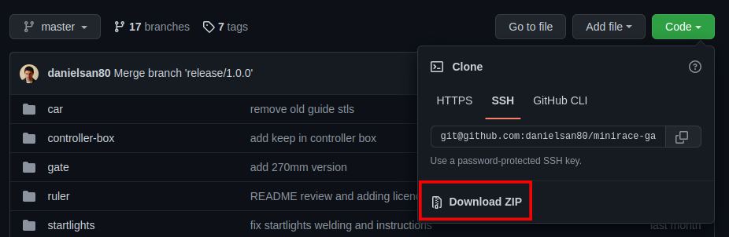

# MiniRaceChallenge 3D printable parts: CONTROLLER BOX

This project provide the box to contain the controller.

The controller is the main timing system module card
to detect the passage of the cars on the start line.

## Getting started: easy way

Install [OpenSCAD](https://openscad.org/)

Download the project (Code -> Download ZIP) from [GitHub repository](https://github.com/danielsan80/minirace-gate).



Unzip the project in a directory (`<project-dir>`).

Find and open with OpenSCAD or with a text editor the file `<project-dir>/controller-box/config/parameters.scad`.

Change the parameters.

> for example your 3D printer may need a different play so you could change the `card_play`
> or any other `*_play` parameter.

After changing some parameter you can open with OpenSCAD the files in `<project-dir>/controller-box/build/scad/print`.

Then render the model (Design -> Render [F6]) and export it as STL (File -> Export -> Export as STL [F7])

That's all. Enjoy!


## Getting started: easy way for Linux users

Tested on Ubuntu 20.04.

You must have OpenSCAD (>=2019.05), ImageMagick and Git installed:

```
sudo apt-get install openscad imagemagick git
```

To build the gate you have to clone this project:

```
git clone git@github.com:danielsan80/minirace-gate.git
```

Enter the project dir:

```
cd minirace-gate
```

Enter in `controller-box` subdir:

```
cd controller-box
```

Now all should be ok.


### Rendering
The `<project-dir>/controller-box/build/scad/sim/*.scad` files are used to show a simulation of the whole controller box
and to generate the preview images.
You can play with these files or with a copy of them.

It is worth to grasp the whole idea.

The `<project-dir>/gate/build/scad/print/*.scad` files contain the single printable parts
and are used to generate the `*.stl` files at build time.


### Build

It's time to build the .stl files from the .scad files.

Run the build script:

```
bin/build
```

At the end of the build script running, you should have a new directory `<project-dir>/controller-box/build/stl`
with all updated .stl files

If you have to rebuild them you can clean up the build dir running

```
bin/cleanup
```

and rerun the `bin/build` script.

The dir `<project-dir>/gate/build/scad/print` contains the .scad version of the generated .stl files.

### Configuration

If you need to change the configuration you can edit the `gate/config/parameters.scad` file.

I tried to put all values in a parameter in this file. Tha major part of them should be considered as constants.

It makes sense to change only a few of them.

### Printing

I added a little [Printing guide](doc/printing.md) to help you to print the controller box.

The guide refers to the Thingiverse built .stl files. 


