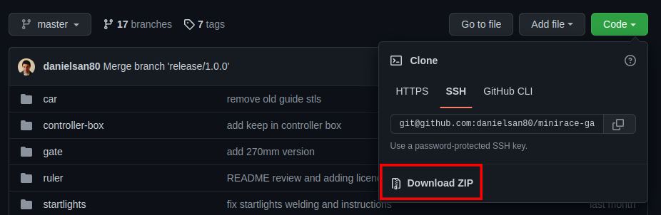

# MiniRace Gate Project: gate

This subproject assembles the gate and all other stuff together to simulate
and build the printable parts in stl files.
It adds the joint to hang up the startlights on the traverse.
It uses the controller box and terminal box as basements for its uprights.
It uses the rules to show the measures in the simulation context.

## Getting started

### Easy way

Install [OpenSCAD](https://openscad.org/)

Download the project (Code -> Download ZIP) from [GitHub repository](https://github.com/danielsan80/minirace-gate).



Unzip the project in a directory (`<project-dir>`).

Create a link `<project-dir>/gate/vendor` -> `<project-dir>` 

Find and open with OpenSCAD or with a text editor the file `<project-dir>/gate/config/parameters.scad`.

Change the parameters.

> for example if you want to change the length of the traverse,
you must change the `startline_l` parameter, setting the distance (in millimeters) between the boxes.

After changing some parameter you can open with OpenSCAD one of the files in `<project-dir>/gate/build/scad/print`.

> if you have changed the `startline_l` parameter you probably want to obtain the new stl traverse files:
> so open `<project-dir>/gate/build/scad/print/gate/traverse/traverse.scad`
> or one of his variants in `.../print/gate/traverse/variant/**/*.scad`.
 
Then render the model (Design -> Render [F6]) and export it as STL (File -> Export -> Export as STL [F7])

That's all. Enjoy!


### Easy way for Linux users

Tested on Ubuntu 20.04.

You must have OpenSCAD (>=2019.05) and ImageMagick installed:

```
sudo apt-get install openscad imagemagick
```

To build the gate you have to clone this project:

```
git clone git@github.com:danielsan80/minirace-gate.git
```

Enter the project dir:

```
cd minirace-gate
```

## Setup
After cloning the project fron Github and moving into the project dir you must setup the project.

Enter in gate subdir:

```
cd gate
```

Run the setup script:

```
bin/setup
```

Now all should be ok.

## Rendering
The `gate/main.scad` is a "whiteboard" I used to see the simulation of the whole gate and its parts,
adding and removing modules to see if all fit together.

It is worth to grasp the whole idea.

## Build

It's time to build the .stl files from the .scad files.


Run the build script:

```
bin/build
```

At the end of the build script running you should have a new directory `gate/build/stl`
with all updated .stl files

If you have to rebuild them you can delete the stl dir and rerun the `bin/build` script. 

The dir `gate/build/scad` contains the .scad version of the generated .stl files. 

## Configuration

If you need to change the configuration you can edit the `gate/config/parameters.scad` file.

I tried to put all values in a parameter in this file. Tha major part of them should be considered as constants.

It makes sense to change only a few of them. 
